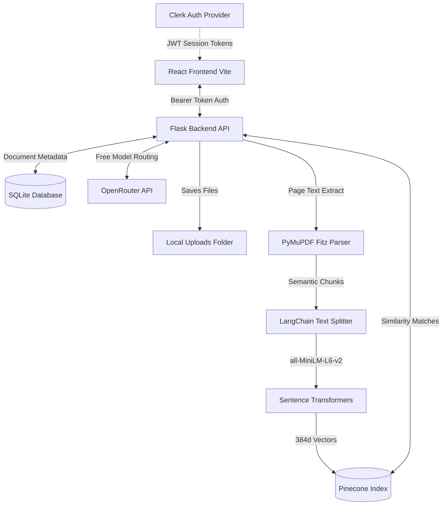

# AI HR Knowledge Assistant

An intelligent Retrieval-Augmented Generation (RAG) platform that allows employees to ask natural language questions about company policies, guidelines, and handbooks, and receive verified answers with source citations. 

The application features a secure admin dashboard where HR managers can upload, index, and manage PDF documents dynamically.

---

## 🏗️ Architecture



### Key Components:
1.  **Frontend (React + Vite)**: Configured with custom theme variables (Dark/Light mode support), Clerk UI wrappers, and message scrolling components.
2.  **Authentication (Clerk)**: Handles user login, profile management, and session tokens. Roles are verified on both the frontend and backend using JWT token payload claims.
3.  **Backend (Flask + Flask-SQLAlchemy)**: Tracks document processing state, serves static files, and validates session tokens using RSA signature verification.
4.  **Database (SQLite)**: Stores local file metadata, upload timestamps, and status parameters.
5.  **Vector Store (Pinecone Serverless)**: Maintains document chunk vectors and metadata (source filename and page references).
6.  **Embedding Model (`all-MiniLM-L6-v2`)**: Transforms text passages into dense 384-dimensional vector embeddings on-the-fly.
7.  **LLM Generation (OpenRouter)**: Grounded prompting built around the `openrouter/free` endpoint to generate accurate answers from context.

---

## 🛠️ Configuration & Credentials

### 1. Backend Config
Create a file named `.env` inside the `backend/` directory:
```env
FLASK_APP=app.py
FLASK_ENV=development
PORT=5000

# Clerk RSA Signature Verification JWKS URL
CLERK_JWKS_URL=https://<your-clerk-app>.clerk.accounts.dev/.well-known/jwks.json

# Pinecone Credentials
PINECONE_API_KEY=your_pinecone_api_key
PINECONE_INDEX_NAME=ai-hr-assistant-index

# OpenRouter Key for RAG LLM
OPENROUTER_API_KEY=your_openrouter_api_key
```

### 2. Frontend Config
Create a file named `.env.local` inside the `frontend/` directory:
```env
VITE_CLERK_PUBLISHABLE_KEY=pk_test_...
```

---

## 🚀 Local Setup Guide

### 1. Run the Flask Backend
Navigate to the `backend/` directory and install the requirements:
```powershell
cd backend
pip install -r requirements.txt
```
Launch the API server:
```powershell
python app.py
```
*(On the first launch, it will automatically download the `all-MiniLM-L6-v2` embedding model to your local machine).*

### 2. Run the React Frontend
Navigate to the `frontend/` directory and install the dependencies:
```powershell
cd frontend
npm install
```
Launch the Vite development server:
```powershell
npm run dev
```

Open `http://localhost:5173/` in your browser to start asking questions!
